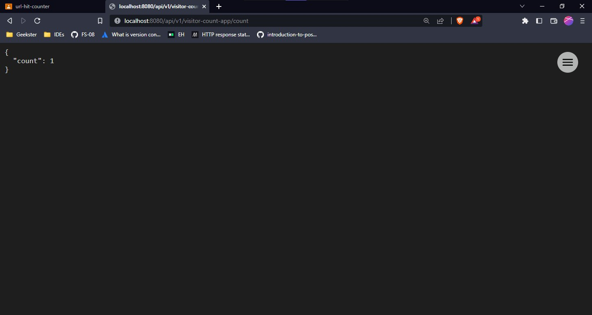
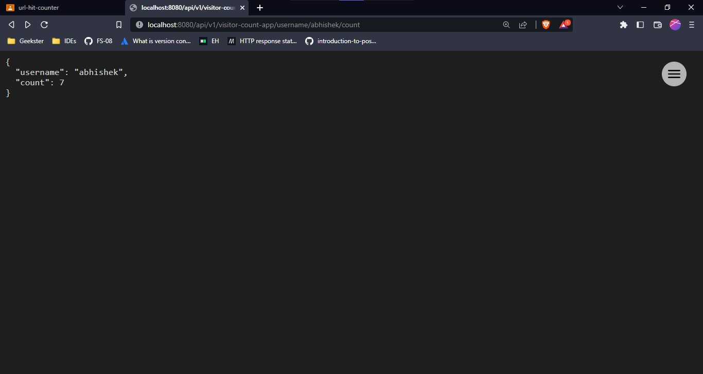
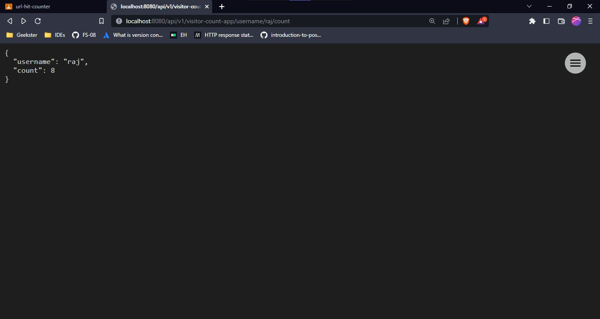

# Visitor-Count-App
In this app, we can hit the api given below to get the number of hit counts.
#### Tools used:
-  JDK 17
-  Intelij IDEA
#### Dependencies used:
-  Spring Web
-  Spring Boot Dev Tools

> http://localhost:8080/api/v1/visitor-count-app


## 📃Documentation
### End Points
- /count
- /username/{username}/count

- ### Getting Simple Hit Counts
```rs
GET http://localhost:8080/api/v1/visitor-count-app/count
```



- ### Getting Hit Counts corresponding to different users
```rs
GET http://localhost:8080/api/v1/visitor-count-app/username/{username}/count
```
## 📌Examples
```
http://localhost:8080/api/v1/visitor-count-app/username/abhishek/count
```

```
http://localhost:8080/api/v1/visitor-count-app/username/abhishek/count
```

```
http://localhost:8080/api/v1/visitor-count-app/username/raj/count
```

